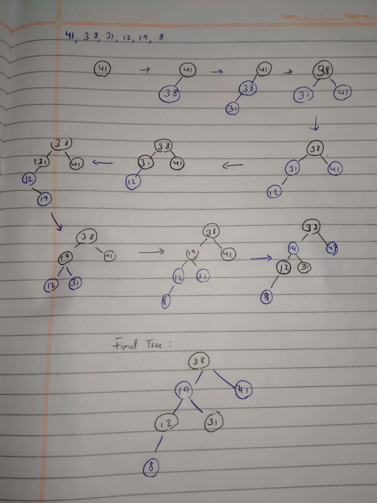

# Red-Black Tress $\rightarrow$ Insertion

## 13.3-1

> In line 16 of $\text{RB-INSERT}$, we set the color of the newly inserted node $z$ to red. Observe that if we had chosen to set $z$'s color to black, then property 4 of a red-black tree would not be violated. Why didn't we choose to set $z$'s color to black?

If $z$ was colored black, it would have resulted in one more black node in a single path, that would violate the property 5__(every node should have same number of black nodes till all its descendants)__.

## 13.3-2

> Show the red-black trees that result after successively inserting the keys $41, 38, 31, 12, 19, 8$ into an initially empty red-black tree.

Except root node, there can be rotations on any other nodes. So a total of $n-1$ possible rotations in Binary Search Tree.

## 13.3-3

> Suppose that the black-height of each of the subtrees $\alpha, \beta, \gamma, \delta, \epsilon$ in Figures 13.5 and 13.6 is $k$. Label each node in each figure with its black-height to verify that the indicated transformation preserves property 5.

It can be easily said, that there is no change in the black-heights after every operation, even if there is, it is made accustomed in every other part as well.

## 13.3-4

> Professor Teach is concerned that $\text{RB-INSERT-FIXUP}$ might set $T.nil.color$ to $\text{RED}$, in which case the test in line 1 would not cause the loop to terminate when $z$ is the root. Show that the professor's concern is unfounded by arguing that $\text{RB-INSERT-FIXUP}$ never sets $T.nil.color$ to $\text{RED}$.

First observe that $\text{RB-INSERT-FIXUP}$ only modifies the child of a node if it is already $\text{RED}$, so we will never modify a child which is set to $T.nil$. We just need to check that the parent of the root is never set to $\text{RED}$.

## 13.3-5

> Consider a red-black tree formed by inserting $n$ nodes with $\text{RB-INSERT}$. Argue that if $n > 1$, the tree has at least one red node.
- **Case 1:** $z$ and $z.p.p$ are $\text{RED}$, if the loop terminates, then $z$ could not be the root, thus $z$ is $\text{RED}$ after the fix up.
- **Case 2:** $z$ and $z.p$ are $\text{RED}$, and after the rotation $z.p$ could not be the root, thus $z.p$ is $\text{RED}$ after the fix up.
- **Case 3:** $z$ is $\text{RED}$ and $z$ could not be the root, thus $z$ is $\text{RED}$ after the fix up.

For example, if n=2, a red node can be put either side, which satisfies every __RB property__. 

Therefore, there is always at least one red node.

## 13.3-6

> Suggest how to implement $\text{RB-INSERT}$ efficiently if the representation for red-black trees includes no storage for parent pointers.
