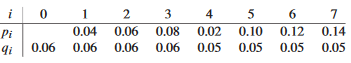

# Dynamic Programming - Optimal BST

## 15.5-1

> Write pseudocode for the procedure $\text{CONSTRUCT-OPTIMAL-BST}(root)$ which, given the table $root$, outputs the structure of an optimal binary search tree. For the example in Figure 15.10, your procedure should print out the structure
- 
    ```
    k2 is the root
    k1 is the left child of k2
    d0 is the left child of k1
    d1 is the right child of k1
    k5 is the right child of k2
    k4 is the left child of k5
    k3 is the left child of k4
    d2 is the left child of k3
    d3 is the right child of k3
    d4 is the right child of k4
    d5 is the right child of k5
    ```

> corresponding to the optimal binary search tree shown in Figure 15.9(b).


```cpp
CONSTRUCT-OPTIMAL-BST(root, i, j, last)
    if i == j
        return
    if last == 0
        print root[i, j] + "is the root"
    else if j < last
        print root[i, j] + "is the left child of" + last
    else
        print root[i, j] + "is the right child of" + last
    CONSTRUCT-OPTIMAL-BST(root, i, root[i, j] - 1, root[i, j])
    CONSTRUCT-OPTIMAL-BST(root, root[i, j] + 1, j, root[i, j])
```

## 15.5-2

> Determine the cost and structure of an optimal binary search tree for a set of $n = 7$ keys with the following probabilities

 

 
Cost is $3.12$.
```
Optimal BST
k5 is the root
k2 is the left child of  k5
k1 is the left child of  k2
d0 is the left child of  k1
d1 is the right child of  k1
k3 is the right child of  k2
d2 is the left child of  k3
k4 is the right child of  k3
d3 is the left child of  k4
d4 is the right child of  k4
k2 is the left child of  k5
k1 is the left child of  k2
d0 is the left child of  k1
d1 is the right child of  k1
k3 is the right child of  k2
d2 is the left child of  k3
k4 is the right child of  k3
d3 is the left child of  k4
d4 is the right child of  k4
```

## 15.5-3

> Suppose that instead of maintaining the table $w[i, j]$, we computed the value of $w(i, j)$ directly from equation $\text{(15.12)}$ in line 9 of $\text{OPTIMAL-BST}$ and used this computed value in line 11. How would this change affect the asymptotic running time of $\text{OPTIMAL-BST}$?

Computing $w(i, j)$ from the equation is $\Theta(j - i)$, since the loop below on lines 10-14 is also $\Theta(j - i)$, it wouldn't affect the asymptotic running time of $\text{OPTIMAL-BST}$ which would stay $\Theta(n^3)$.


## 15.5-4 $\star$

> Knuth [212] has shown that there are always roots of optimal subtrees such that $root[i, j - 1] \le root[i, j] \le root[i + 1, j]$ for all $1 \le i < j \le n$. Use this fact to modify the $\text{OPTIMAL-BST}$ procedure to run in $\Theta(n^2)$ time.

*__To-do__*