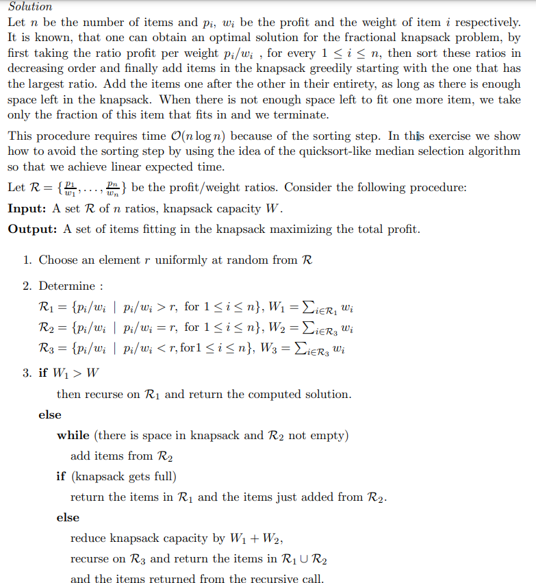

# Greedy Problems - Understanding it better

## 16.2-1

> Prove that the fractional knapsack problem has the greedy-choice property.

Let $I$ be the instance of the knapsack problem, n be the number of items, $v_i$ be the values of $i$th item with weight $w_i$ and $W$ be the maximum weight that can be in knapsack.

Arrange given items in ascending order by $v_i/w_i$ and $W >= w_n$.

Now, select the max amount per item which can be filled till $W=0$.

Suppose in an optimal solution we take an item with $v_1$, $w_1$, and drop an item with $v_2$, $w_2$, and $w_1 > w_2$, $v_1 < v_2$, we can substitute $1$ with $2$ and get a better solution. Therefore we should always choose the items with the greatest values.

## 16.2-2

> Give a dynamic-programming solution to the $0$-$1$ knapsack problem that runs in $O(nW)$ time, where $n$ is the number of items and $W$ is the maximum weight of items that the thief can put in his knapsack.

```cpp
0_1_KNAPSACK(n, W)
    table[n+1][W+1] -> k

    for i=1 to n
        k[i,0] = 0
    for j=1 to W
        k[0,j] = 0
    
    for i=1 to n
        for j=1 to W
            if j< i.weight
                k[i,j] = k[i-1,j]
            else
                k[i,j] = max(k[i-1,j], k[i-1,j-weight[i]] + value[i])

```
## 16.2-3

> Suppose that in a $0$-$1$ knapsack problem, the order of the items when sorted by increasing weight is the same as their order when sorted by decreasing value. Give an efficient algorithm to find an optimal solution to this variant of the knapsack problem, and argue that your algorithm is correct.

Let's say we have $v_1$, $w_1$ and $v_2$,$w_2$ and $w_1 > w_2$, $v_1 < v_2$, in this case we always choose, items with higher value.


## 16.2-4

> Professor Gekko has always dreamed of inline skating across North Dakota. He plans to cross the state on highway U.S. 2, which runs from Grand Forks, on the eastern border with Minnesota, to Williston, near the western border with Montana. The professor can carry two liters of water, and he can skate $m$ miles before running out of water. (Because North Dakota is relatively flat, the professor does not have to worry about drinking water at a greater rate on uphill sections than on flat or downhill sections.) The professor will start in Grand Forks with two full liters of water. His official North Dakota state map shows all the places along U.S. 2 at which he can refill his water and the distances between these locations.
>
> The professor's goal is to minimize the number of water stops along his route across the state. Give an efficient method by which he can determine which water stops he should make. Prove that your strategy yields an optimal solution, and give its running time.

This can be solved optimally, where we maaximize distance, we can cover from a particular point, such that there exists a place to get water before we run out.

The problem exhibits optimal substructure, since once we have chosen a first stopping point $p$, we solve the subproblem assuming we are starting at $p$. Combining these two plans yields an optimal solution for the usual cut-and-paste reasons. 

Therefore the greedy strategy works.

## 16.2-5

> Describe an efficient algorithm that, given a set $\\{x_1, x_2, \ldots, x_n\\}$ of points on the real line, determines the smallest set of unit-length closed intervals that contains all of the given points. Argue that your algorithm is correct.

Consider the leftmost interval. It will do no good if it extends any further left than the leftmost point, however, we know that it must contain the leftmost point. So, we know that it's left hand side is exactly the leftmost point.

So, we just remove any point that is within a unit distance of the left most point since they are contained in this single interval. Then, we just repeat until all points are covered. Since at each step there is a clearly optimal choice for where to put the leftmost interval, this final solution is optimal.

## 16.2-6 $\star$

> Show how to solve the fractional knapsack problem in $O(n)$ time.


First compute the value of each item, defined to be it's worth divided by its weight. We use a recursive approach as follows, find the item of median value, which can be done in linear time. Then sum the weights of all items whose value exceeds the median and call it $M$. If $M$ exceeds $W$ then we know that the solution to the fractional knapsack problem lies in taking items from among this collection. In other words, we're now solving the fractional knapsack problem on input of size $n / 2$. On the other hand, if the weight doesn't exceed $W$, then we must solve the fractional knapsack problem on the input of $n / 2$ low-value items, with maximum weight $W − M$. Let $T(n)$ denote the runtime of the algorithm. Since we can solve the problem when there is only one item in constant time, the recursion for the runtime is $T(n) = T(n / 2) + cn$ and $T(1) = d$, which gives runtime of $O(n)$.

For better understanding...



## 16.2-7

> Suppose you are given two sets $A$ and $B$, each containing $n$ positive integers. You can choose to reorder each set however you like. After reordering, let $a_i$ be the $i$th element of set $A$, and let $b_i$ be the $i$th element of set $B$. You then receive a payoff of $\prod_{i = 1}^n a_i^{b_i}$. Give an algorithm that will maximize your payoff. Prove that your algorithm maximizes the payoff, and state its running time.

We can do this, by arranging $A$ in sorted ascending order and $B$ is also sorted in ascending order to get the maximum product.

 To see this, suppose not, that is, there is some $i < j$ so that $a_i < a_j$ and $b_i > b_j$. Then, consider only the contribution to the product from the indices $i$ and $j$. That is, $a_i^{b_i}a_j^{b_j}$, then, if we were to swap the order of $b_i$ and $b_j$, we would have that contribution be $a_i^{b_j}a_j^{b_i}$. we can see that this is larger than the previous expression because it differs by a factor of $\left(\frac{a_j}{a_i}\right)^{b_i - b_j}$ which is bigger than one. So, we couldn't of maximized the product with this ordering on $B$.