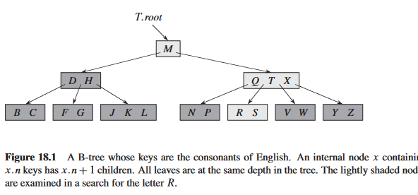

# Advanced Data Structures

## Getting Started with `B-Trees`

## 18.1-1

> Why don't we allow a minimum degree of $t = 1$?

The structure of `B-tree` is..

$\text{Number of nodes in root = t}$
$\text{Every other internal node except root has atleast =t-1 keys and at most 2t-1}$

If, it `t = 1`, every internal node except root would have `0` keys, which can't be true!
So, a tree with $\text{minimum degree = 1}$ is a no go!

## 18.1-2

> For what values of $t$ is the tree of Figure 18.1 a legal B-tree?

According to the property of B-Tree, every node except has atleast $\text{t-1}$ keys and atmost $\text{2t-1}$ keys. And in the figure there are either $2$ or $3$ keys in internal nodes. So this would yeild, that it is a legal __B-Tree__ with $t$ being $\text{2 or3 }$

## 18.1-3

> Show all legal B-trees of minimum degree $2$ that represent $\\{1, 2, 3, 4, 5\\}$.

Since we the B-Tree node-key property. Each node has atleast $\text{t-1 = 1}$ keys and atmost $\text{2t-1 = 3}$ keys.
So, a minimum of 1 and maximum of 3 keys in internal nodes.
So the B-trees for this are...

$$
[1 , 2, 3, 4,5]
$$

$$[3]$$
$$\swarrow \text{\  } \searrow$$
$$[1, 2] \text{\ \ \ \ \ \ \ \ \ \  }  [4, 5]$$

## 18.1-4

> As a function of the minimum degree $t$, what is the maximum number of keys that can be stored in a B-tree of height $h$?

Maximum number of nodes that can be stored in a B-Tree of minimum degree $t$, are

$$
\begin{aligned}
n = 2t^{h+1} -1
\end{aligned}
$$

## 18.1-5

> Describe the data structure that would result if each black node in a red-black tree were to absorb its red children, incorporating their children with its own.

If a black parent in Red-Black Tree, were to absorb red-childrens, it would decrease the height of the tree, and the black-parent would now consist of either $1$,$2$ or $3$ keys, which is the same as the B-Tree of minimum degree $t = 2$, i.e. a $2-3-4$ tree