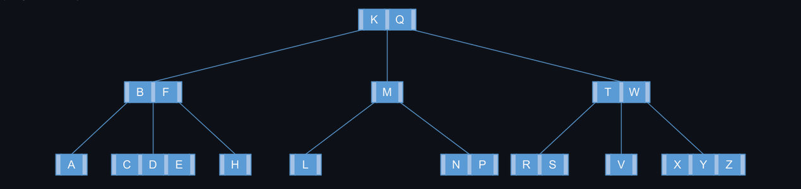

# Advanced Data Structures

## Basic Operations on B-Trees

## 18.2-1

> Show the results of inserting the keys
>
> $$F, S, Q, K, C, L, H, T, V, W, M, R, N, P, A, B, X, Y, D, Z, E$$
>
> in order into an empty B-tree with minimum degree $2$. Draw only the configurations of the tree just before some node must split, and also draw the final configuration.

## 18.2-2

> Explain under what circumstances, if any, redundant $\text{DISK-READ}$ or $\text{DISK-WRITE}$ operations occur during the course of executing a call to $\text{B-TREE-INSERT}$. (A redundant $\text{DISK-READ}$ is a $\text{DISK-READ}$ for a page that is already in memory. A redundant $\text{DISK-WRITE}$ writes to disk a page of information that is identical to what is already stored there.)

In order to insert the key into a full child node but without its parent being full, we need the following operations:

- $\text{DISK-READ}$: Key placement
- $\text{DISK-WRITE}$: Split nodes
- $\text{DISK-READ}$: Get to the parent
- $\text{DISK-WRITE}$: Fill parent

If both were full, we'd have to do the same, but instead of the final step, repeat the above to split the parent node and write into the child nodes. With both considerations in mind, there should never be a redundant $\text{DISK-READ}$ or $\text{DISK-WRITE}$ on a $\text{B-TREE-INSERT}$.

## 18.2-3

> Explain how to find the minimum key stored in a B-tree and how to find the predecessor of a given key stored in a B-tree.
