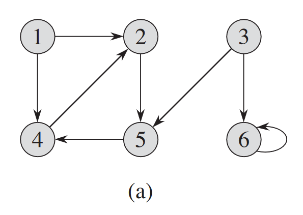
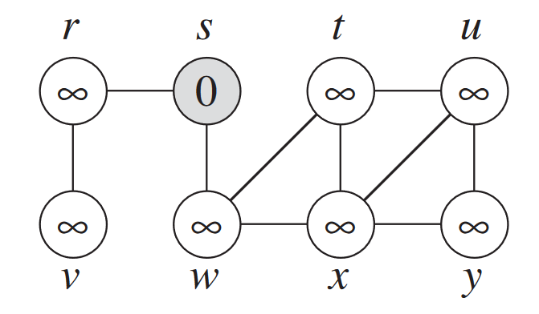

# GRAPH ALGORITHMS

## BREADTH FIRST SEARCH

## 22.2-1

> Show the $d$ and $\pi$ values that result from running breadth-first search on the directed graph of Figure 22.2(a), using vertex $3$ as the source.


### Solution

$$
\begin{array}{c|cccccc}
\text{vertex} & 1 & 2 & 3 & 4 & 5 & 6 \\\\
\hline
d & \infty & 3 & 0 & 2 & 1 & 1 \\\\
\pi & \text{NIL} & 4 & \text{NIL} & 5 & 3 & 3
\end{array}
$$

## 22.2-2

> Show the $d$ and $\pi$ values that result from running breadth-first search on the undirected graph of Figure 22.3, using vertex $u$ as the source.


### Solution

$$
\begin{array}{c|cccccc}
\text{vertex} & r & s & t & u & v & w & x & y \\\\
\hline
d & 4 & 3 & 1 & 0 & 5 & 2 & 1 & 1 \\\\
\pi & s & w & u & \text{NIL} & r & t & u & u
\end{array}
$$

## 22.2-3

> Show that using a single bit to store each vertex color suffices by arguing that the $\text{BFS}$ procedure would produce the same result if lines 5 and 14 were removed.

### Solution

If $GRAY$ then the node is enqueued, $BLACK$ if it is dequeued!
In short, just a simple boolean array would suffice to store the state of vertex.

## 22.2-4

> What is the running time of $\text{BFS}$ if we represent its input graph by an adjacency matrix and modify the algorithm to handle this form of input?

### Solution

Running time becomes $O(V^2)$ as we need to iterate over entire matrix to edges

## 22.2-5

> Argue that in a breadth-first search, the value $u.d$ assigned to a vertex $u$ is independent of the order in which the vertices appear in each adjacency list. Using Figure 22.3 as an example, show that the breadth-first tree computed by $\text{BFS}$ can depend on the ordering within adjacency lists.

### Solution

In case of distance of node $u$ to $v$ it remains same, no matter the order, because the path always remain same.
In case of order of computed BFS, this changes according to how the graph's adjacency list is made from given edges, which can be any order.

## 22.2-6

> Give an example of a directed graph $G = (V, E)$, a source vertex $s \in V$, and a set of tree edges $E_\pi \subseteq E$ such that for each vertex $v \in V$, the unique simple path in the graph $(V, E_\pi)$ from $s$ to $v$ is a shortest path in $G$, yet the set of edges $E_\pi$ cannot be produced by running $\text{BFS}$ on $G$, no matter how the vertices are ordered in each adjacency list.

### Solution

This is possible when the destination vertex $d$ is a neighbour of source vertex $s$.


## 22.2-7

> There are two types of professional wrestlers: "babyfaces" ("good guys") and "heels" ("bad guys"). Between any pair of professional wrestlers, there may or may not be a rivalry. Suppose we have $n$ professional wrestlers and we have a list of $r$ pairs of wrestlers for which there are rivalries. Give an $O(n + r)$-time algorithm that determines whether it is possible to designate some of the wrestlers as babyfaces and the remainder as heels such that each rivalry is between a babyface and a heel. If it is possible to perform such a designation, your algorithm should produce it.

### Solution

This problem is the classic 2-color graph coloring spin-off where 2 nodes are not adjadjacent if they have rivalary between them.

This problem is basically just a obfuscated version of two coloring. We will try to color the vertices of this graph of rivalries by two colors, "babyface" and "heel". To have that no two babyfaces and no two heels have a rivalry is the same as saying that the coloring is proper. To two color, we perform a breadth first search of each connected component to get the $d$ values for each vertex. Then, we give all the odd ones one color say "heel", and all the even d values a different color. We know that no other coloring will succeed where this one fails since if we gave any other coloring, we would have that a vertex $v$ has the same color as $v.\pi$ since $v$ and $v.\pi$ must have different parities for their $d$ values. Since we know that there is no better coloring, we just need to check each edge to see if this coloring is valid. If each edge works, it is possible to find a designation, if a single edge fails, then it is not possible. Since the BFS took time $O(n + r)$ and the checking took time $O(r)$, the total runtime is $O(n + r)$.

## 22.2-8 $\star$

> The **_diameter_** of a tree $T = (V, E)$ is defined as $\max_{u,v \in V} \delta(u, v)$, that is, the largest of all shortest-path distances in the tree. Give an efficient algorithm to compute the diameter of a tree, and analyze the running time of your algorithm.


To find the diameter of a graph G:

```cpp
diameter=0
for each vertex v in V(G)
    do breadth-first search starting at v
        for each vertex u in V(G)
            if d(u,v) > diameter
                diameter = d(u,v)
return diameter
```

This runs in time $O(|V|.|E|)$.

## 22.2-9

First, the algorithm computes a minimum spanning tree of the graph. Note that this can be done using the procedures of Chapter 23. It can also be done by performing a breadth first search, and restricting to the edges between $v$ and $v.\pi$ for every $v$. To aide in not double counting edges, fix any ordering $\le$ on the vertices before hand. Then, we will construct the sequence of steps by calling $\text{MAKE-PATH}(s)$, where $s$ was the root used for the $\text{BFS}$.

```cpp
MAKE-PATH(u)
    for each v ∈ Adj[u] but not in the tree such that u ≤ v
        go to v and back to u
    for each v ∈ Adj[u] but not equal to u.π
        go to v
        perform the path proscribed by MAKE-PATH(v)
    go to u.π
```

Or simply,have an visited array with BFS, and mark the edge visted just like the traversing.