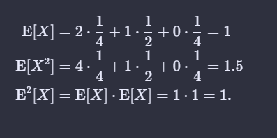

# Chapter 8.4 Sort

## 8.4-1 $\star$

> Using Figure 8.4 as a model, illustrate the operation of $\text{BUCKET-SORT}$ on the array $A = \langle .79, .13, .16, .64, .39, .20, .89, .53, .71, .42 \rangle$.

### Algorithm

```(algorithm)
1. Let A[] be the numbers to be sorted.
2. Array of linked-list through buckets(n-sized).
3. For every B[i] (0-n) assign its value using the formula
     B[(A[i]*n)/ max(max n-digit number)] = A[i]
4. For more than 1 number in a bucket, create a linked list..sorting itself, when the value is added.
5. After adding n-numbers in buckets, concatenating every bucket one-by-one to get sorted numbers.
```

#### Example

$A = \langle .79, .13, .16, .64, .39, .20, .89, .53, .71, .42 \rangle$.

```(example)
0 [X]
1 []->[0.13]->[0.16]
2 []->[0.20]
3 []->[0.39]
4 []->[0.42]
5 []->[0.53]
6 []->[0.64]
7 []->[0.71]->[0.79]
8 []->[0.89]
9 [X]
```

## 8.4-2 $\star$
> Explain why the worst-case running time for bucket sort is $\Theta(n^2)$. What simple change to the algorithm preserves its linear average-case running time and makes its worst-case running time $O(n\lg n)$?
### Solution
When all the elements are added in the same bucket instead of different buckets,
So `O(n)` time for buckets, and when all `n` elements are in same buckets it take `O(n*n)` time.

We can use merge sort or heapsort to improve the worst-case running time. Insertion sort was chosen because it operates well on linked lists, which has optimal time and requires only constant extra space for short linked lists. If we use another sorting algorithm, we have to convert each list to an array, which might slow down the algorithm in practice.

## 8.4-3 $\star$

> Let $X$ be a random variable that is equal to the number of heads in two flips of a fair coin. What is $\text E[X^2]$? What is $\text E^2[X]$?


### Solution

Number of heads = 2 , 1 , 0

And their respective probabilities



## 8.4-4 $\star$

> We are given $n$ points in the unit circle, $p_i = (x_i, y_i)$, such that $0 < x_i^2 + y_i^2 \le 1$ for $i = 1, 2, \ldots, n$. Suppose that the points are uniformly distributed; that is, the probability of finding a point in any region of the circle is proportional to the area of that region. Design an algorithm with an average-case running time of $\Theta(n)$ to sort the $n$ points by their distances $d_i = \sqrt{x_i^2 + y_i^2}$ from the origin. ($\text{Hint:}$ Design the bucket sizes in $\text{BUCKET-SORT}$ to reflect the uniform distribution of the points in 
the unit circle.)

### Soution :
$$
\begin{aligned}
\pi r_i^2 & = \frac{i}{n} \cdot \pi 1^2 \\\\
r_i & = \sqrt{\frac{i}{n}}.
\end{aligned}
$$

Basically what we do is, calculate the assignment of values using the formula

$$
\begin{aligned}
\large B[ {A[i]*n\over \text{max n-digit number}+1}]= A[i]
\end{aligned}
$$

## 8.4-5 $\star$

> A **_probability distribution function_** $P(x)$ for a random variable $X$ is defined by $P(x) = \Pr\\{X \le x\\}$. Suppose that we draw a list of $n$ random variables $X_1, X_2, \ldots, X_n$ from a continuous probability distribution function $P$ that is computable in $O(1)$ time. Give an algorithm that sorts these numbers in linear average-case time.

### Solution :
Bucket sort by $p_i$, so we have $n$ buckets: $[p_0, p_1), [p_1, p_2), \dots, [p_{n - 1}, p_n)$. Note that not all buckets are the same size, which is ok as to ensure linear run time, the inputs should on average be uniformly distributed amongst all buckets, of which the intervals defined with $p_i$ will do so.

$p_i$ is defined as follows:

$$P(p_i) = \frac{i}{n}.$$

All this does have n probabilities like ex8-4.4

