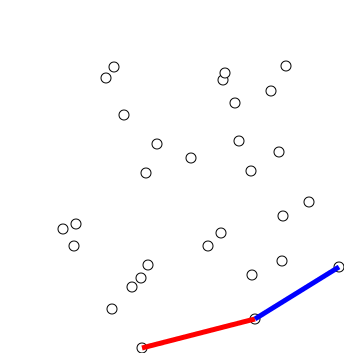

# Graham Scan

Given a set of points, a perimeter which covers all the points is a minimum shaped convex hull.

## Input

Given a set of points in 2-D coordinate system.

## Output

Return a set of points which are on the boundary of the convex hull or in simpler words, it can also be said to find the nodes located at any perimeter such as fence, where the perimeter of the fence is minimum.

## How it works ?

Let's say, I got 3 points say `A`,`B`,`C`.. I am currently at point `A`, I know a line passes through two points, right? But what about 3rd point? I need to adjust it somewhere as well. `C` can be three different forms.

- `C` is collinear to `A` and `B`.
- `C` makes an angle bigger 180&deg;. -> mkaing it a part of convex hull
- `C` makes an angle less than 180&deg;. -> making it non-convex hull.

More formally, we are trying to make a convex hull of all these points and we know the property of convex hull to have all the vertices/nodes making an angle less than or equal to 180&deg; or having every line contained inside the shape itself. The opposite is true for non-convex hull.

It's say going angle > 180&deg; `right side` and _<=_ 180&deg; as `left side`.

What I want is to always move to left side, and by chance if I encouter any move to right side, I want to backtrack to the point and calculate until is becomes left side with current point.
For backtracking, I use stack, where i always access to last 2 elements added, without modifying the current stack.

Okay, it's getting pretty heavy, let me use a example...
I got 6 objects at points -

> (1,1), (2,0), (2,2), (2,4), (3,3)_, (4,2)

I want to enclose them in such a way that they cover least perimeter, where objects can be located at the perimeter or inside the perimeter.

### Algorithm

1. P0 -> lowest y-index coordinate, if multiple, select the coordinate, having both x and y index lowest.

2. All other n-1 points are sorted by polar angle in clockwise order. If the polar angle between two points is the same, the nearest point is chosen instead. 

3. Then we iterate through each point one by one, and make sure that the current point and the two before it make a clockwise turn, otherwise the previous point is discarded, since it would make a non-convex shape. Checking for clockwise or anticlockwise nature can be done by checking the orientation.

4. We use a stack to store the points, and once we reach the original point  $P_0$ , the algorithm is done and we return the stack containing all the points of the convex hull in clockwise order.

5. If you need to include the collinear points while doing a Graham scan, you need another step after sorting. You need to get the points that have the biggest polar distance from  $P_0$  (these should be at the end of the sorted vector) and are collinear. The points in this line should be reversed so that we can output all the collinear points, otherwise the algorithm would get the nearest point in this line and bail. This step shouldn't be included in the non-collinear version of the algorithm, otherwise you wouldn't get the smallest convex hull.

## Resources

- [Code](./graham_scan.cpp)
- [Cp-Algorithms](https://cp-algorithms.com/geometry/convex-hull.html)

- [Wikipedia](https://en.wikipedia.org/wiki/Graham_scan)